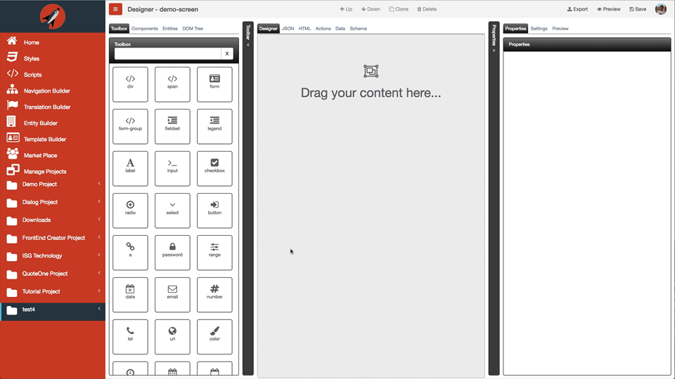
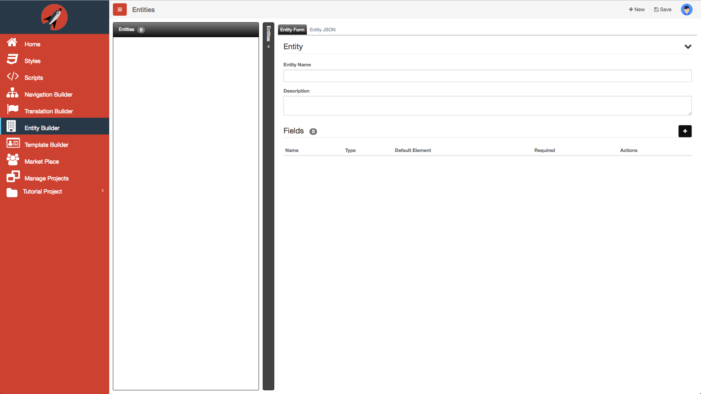
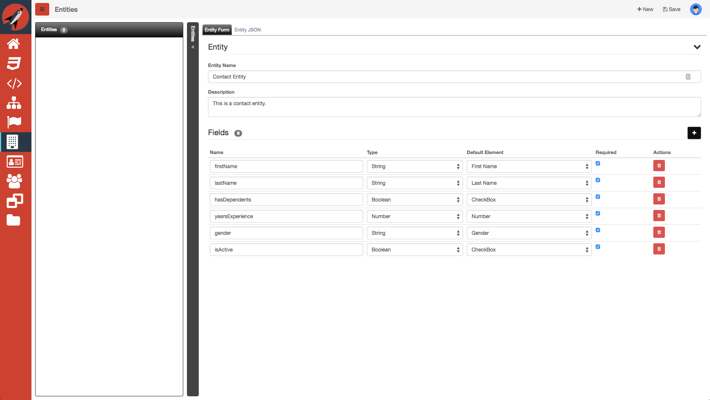
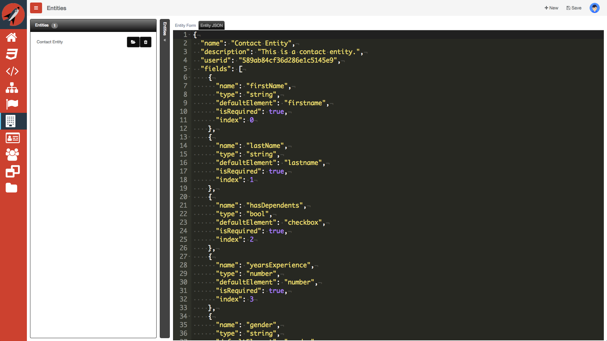
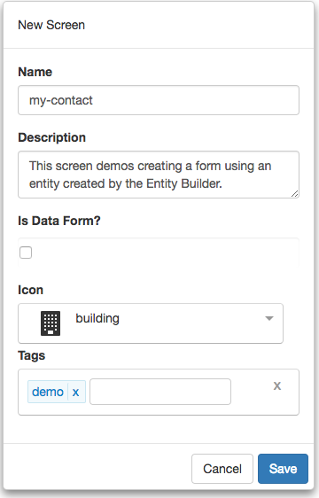
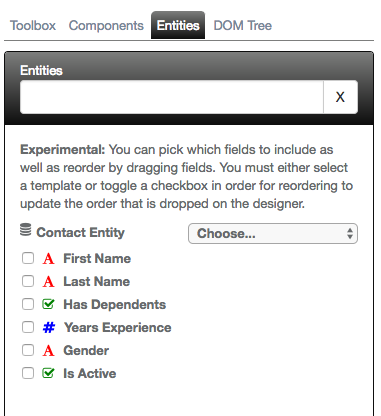
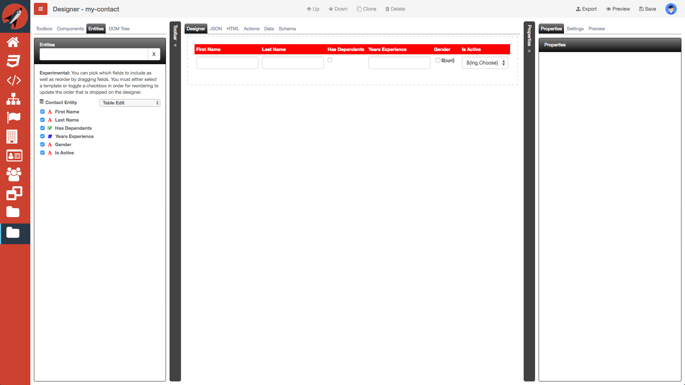

# Entity Builder

The entity builder allows you to quickly create domain models and map them to HTML elements for user entry. It is really meant to speed up your development process when it comes to creating forms. Take a look at the following animation of the designer creating a screen using the Entities tab and an entity created using the **Entity Builder**:



When you click on the Entity Builder button on the left sidebar, you will be presented wit the following screen:



To begin creating a new entity, click on the `New` button on the top left part of the page. You should see some similar to the following. Here we have entered a few fields to give you an idea:



Take a second and use the preceding screenshot to duplicate the same entity on your screen.

When creating a field, you provide the following:

- Name - this is used for both the label and binding of the field. The system will try to normalize the name with spacing if you use camel-casing
- Type - you have the option of `String`, `Boolean`, `Number`, or `Computed`
- Default Element - this determines what HTML element to use when creating the form in the designer
- Required - this represents making the element required. This will change moving forward to work in conjunction with the `Validator`
- Actions - this gives you the ability to delete the field

The following is a table represents the options available for a **String** type:

### String element types
Name | Element | Preview Data
---- | ------- | ------------
TextBox | input[type='text'] | String
Date | input[type='date'] | Date
Email | input[type='email'] | Email
Password | input[type='password'] | Password
Color | input[type='color'] | Color
DateTime-Local | input[type='date'] | Date
Telephone | input[type='tel'] | Telephone
URL | input[type='url'] | url
Radio | input[type='radio'] | Radio values
Select | select | Select options
Image Large | img | Large image source
Image Medium | img | Medium image source
Image | img | Image source
Name | input[type='text'] | Person's name
First Name | input[type='text'] | Person's first name
Last Name | input[type='text'] | Person's last name
Gender | input[type='radio'] | Value between 'Male' and 'Female'
Street | input[type='text'] | Street address
City | input[type='text'] | City
State | input[type='text'] | State
Zip | input[type='text'] | Postal code

The following is a table represents the options available for a **Number** type:

### Number element types
Name | Element | Preview Data
---- | ------- | ------------
TextBox | input[type='text'] | Number
Number | input[type='number'] | Number
Range | input[type='range'] | Number
Month| input[type='month'] | Month number
Week | input[type='week'] | Week number
Radio | input[type='radio'] | Number
Select | select | Select option numbers

The following is a table represents the options available for a **Boolean** type:

### Boolean element types
Name | Element | Preview Data
---- | ------- | ------------
TextBox | input[type='checkbox'] | true or false
TextBox | input[type='radio'] | true or false

> #### info::
> A preview data section was added to the tables to help when you are using the [ Template Builder ](../template-builder/readme.md) and want to visualize your templates immediately.

Click the save button after you have entered the fields you like. Next, if you click on the Entity JSON tab, you should see the following:



Let's now shift gears and look at a simple screen where we want to use this capability. Consider the screenshot below:


We are going to create a new screen, `my-contact` that will utilize the new Contact Entity we created. In case you have created a project, create one called, `Demo`. Next, add a screen called, `my-contact`. 



Now, the designer should be loaded. Click on the Entities tab on the left-side and you should now see the `Contact Entity` we created.

If you click on the label or icon, you should see the following:



You will see color coding and symbols to represent the different data types that were selected when creating the entity. 

If you click on the dropdown, you will be able to choose from the following different types of layout:

- Form Edit - creates a form with editable elements
- Form View - creates a form with non-editable elements
- Table Edit - creates a table with editable elements
- Table View  - creates a table with non-editable elements

Select the type with `Form Edit` and drag the entity onto our designer surface. You should now see the following:


If you save and then click on the Preview tab on the right side, you should see something like the following:


You will notice that the *Gender* element is incomplete. This due to the fact that the HTML is expecting gender values. We will take of that in just a second.

> #### danger::
> The system makes the assumption that you are binding to an object called, `currentItem`. You can change this and anything else to be sure that all is working properly. Also, the system puts placeholders for the Radio bindings and the Select option bindings. You will need to provide the valid objects in order for this to work properly. Sometimes, it is easier to adjust these settings by looking at the HTML tab.

The following is a screenshot of the HTML tab:


Let's leave everything as the default and switch over to the Data tab and add the following:

```javascript
{
  "genderList": [
    "Male",
    "Female"
  ],
  "isActiveList": [
    "Yes",
    "No"
  ],
  "currentItem": {
    "firstName": "Matt",
    "lastName": "Duffield",
    "hasDependents": true,
    "yearsExperience": 20,
    "gender": "Male",
    "isActive": "Yes"
  }
}
```

If you save and now click on the Preview tab, you shoud finally see the following:


Okay, one last twist, let's delete what we have on the designer and drag a Table Edit layout this time. Your designer should look like the following:



> #### danger::
> You may encounter that drag and drop stops working. Simply save your changes and reload the screen.

We will need to change our Data just a little in order to support rows of data instead of a single data object. Switch over to the Data tab and make sure it looks like the following:

```javascript
{
  "genderList": [
    "Male",
    "Female"
  ],
  "isActiveList": [
    "Yes",
    "No"
  ],
  "data": [
    {
      "id": 1,
      "firstName": "Matt",
      "lastName": "Duffield",
      "hasDependents": true,
      "yearsExperience": 20,
      "gender": "Male",
      "isActive": "Yes"
    },
    {
      "id": 2,
      "firstName": "Veronica",
      "lastName": "Duffield",
      "hasDependents": false,
      "yearsExperience": 3,
      "gender": "Female",
      "isActive": "No"
    }
  ]
}
```

Now, save and click on the Preview tab. You may have to drag out the Properties vertical bar so that the rows are all lined up correctly.


Hopefully, you see how easy it is to make changes and adjustments to your screens with minimal coding.

