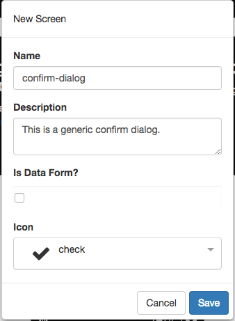

# Dialogs

**FrontEnd Creator** uses the aurelia-dialog plugin to provide dialogs. It has been wrapped to allow for an easy workflow. 

Dialogs are treated just like regular screens but have slightly different behavior. Instead of responding to routes and being displayed, they respond to user interactions. You have the ability to craft the dialog as much as you like within the guidelines of the aurelia-dialog plugin.

The following screenshot is an example of a `screen-dialog` that is used when creating a new or editing an existing screen:



Dialog screens are stored just like regular screens. We use a `dataService` reference to make a fetch call to grab a dialog by its Id. We next use a `dialogService` that handles rendering the dialog to the screen. The function, `show2`, takes a single argument. The following is a signagure of the `payload` parameter:

Property | Description
-------- | -----------
screen | this identifies which dialog screen to use. You must have already loaded the screen using the `dataService`
owner | this identifies under what context the dialog is rendered
data | this represents a data object that your dialog can bind to

The function `show2` is promise-based and will return a promise if dialog screen called, `controller.ok(...)` passing whatever value they wish. You will be able to interrogate the `response` object and make your decision as how you want to proceed.

Refer to the [ Dialog Tutorial ](../../tutorials/dialog.md) for tutorial on working with dialogs in your screens.


> #### primary::
> Please refer to the [ Aurelia Dialog](https://github.com/aurelia/dialog) documentation to learn more about using dialogs.


## Bundling
In order to use the `aurelia-dialog` plugin, it is necessary to bundle it so that you can use it in **FrontEnd Creator**. The following steps will walk you through what is necessary to bundle a plugin. We will be using the Aurelia CLI for the bundling process:

1. Install the plugin using the `Aurelia CLI` as follows:
  ```
  au install aurelia-dialog
  ```
2. Next, open the `aurelia.json` file located under the `aurelia_project` folder.
3. Under the `bundles` section of the file, copy and paste the following:
  ```json
  {
    "name": "aurelia-dialog.js",
    "dependencies": [
      {
        "name": "aurelia-dialog",
        "main": "aurelia-dialog",
        "path": "../node_modules/aurelia-dialog/dist/amd",
        "resources": []
      }
    ]
  }        
  ```
4. Save the `aurelia.json` file.
5. In a terminal window, execute the following command:
  ```
  au build --env prod
  ```
6. This should produce the bundle along with the rest of the buildes defined in the `aurelia.json` file.
7. You should now be able to publish `aurelia-dialog.js` to any server you wish for consumption.
