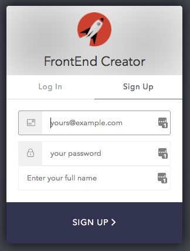
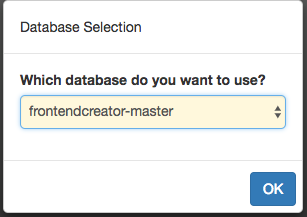
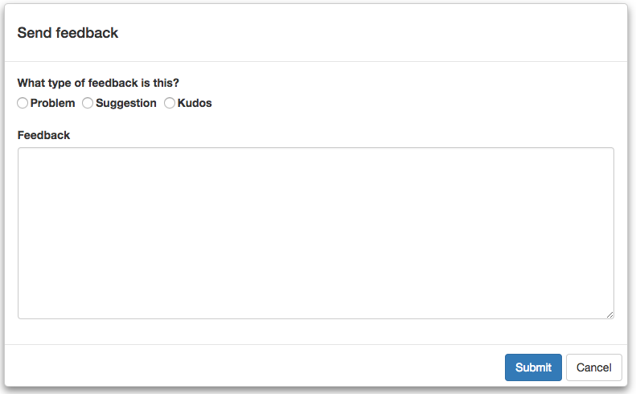

# Login

The following are the steps to login and start using the application.

## User Account
In order to use the application, you will need an account. Every user will have a profile associated with it that will determine your permissions within the application. The same security infrastructure that is in place in the application is available for the applications that you create.

## Sign Up
If you don't have an account, don't worry, you can sign up here. Click on the **Sign Up** tab from the login dialog and fill out the information.

Once you have filled out all of the information, it can take a little bit for your account to be provisioned. You will receive an email once your account is ready to use.

## Logging In
You will need a username and password. 

If you don't have a username and password, you can request one by clicking on the **Sign Up** tab on the dialog.

<!-- ## Advanced
If you have signed up for multiple tiers, you will also be prompted with a dialog asking you which database you wish to select for your work. By default, all users will share the same database. 

 -->

## Logging out

It is possible to log out at any time after you have authenticated. Every screen has a user button in the top right corner. When you click on the button you will see the following dialog:

It is from this dialog that you can log out, note the current version, verify the database, launch help documenation, launch a Feedback dialog, or launch the Application Settings dialog. <!-- It is here that you can update your user avatar by clicking on the top right corner of the dialog. --> 

<!-- Refer to [ User Avatar ](./user-avatar.md) for more information on setting your avatar. -->

### Feedback

Clicking on the **Feedback** link you will be presented with the following dialog:

You can determine what type of feedback as well as a description. Clicking the **Submit** button will persist the information to the database.

### Application Settings

Clicking on the **Application Settings** link you will be presented with the following dialog:

In this dialog, you are able to configure the following:

- Preview Protocol - this allows you to preview your project using HTTP or HTTPS
- Navigation Behavior - this allows you to allow the application to auto-save when navigating away from a dirty file or prompt
- Source Control Repository - this allows you to provide credentials currently for GitHub and Bitbucket

Once you have made your changes, you can click the **Submit** button to persist the information to the database.

