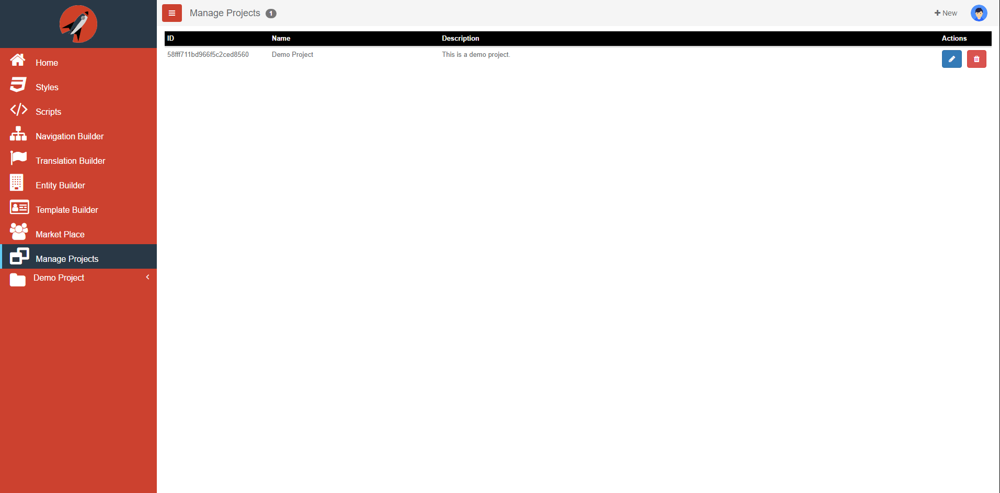

# Projects

To access your Projects, you will choose 'Manage Projects' from the Navigation Menu. Think of projects in terms of an application. Once you are in the 'Manage Projects' screen, you will see a list of all the Projects you have access to.  You can have as many screens associated with a project as you like. The following is a screen shot of the 'Manage Projects' screen:

## Add/Edit Project Dialog

The following is a screen shot of the add/edit dialog that is displayed when you click on the New Button  button at the right side of the header bar or the Edit Button  asscoiated with each project:

Every project has a project name, description, and front end target. Currently Aurelia is the only supported target but long term plans are that we will be adding more framework targets in the future. Next, you will select a CSS library, Bootstrap is currently the only officially supported CSS framework but long term plans include supporting more of these in the future as well.  Finally, you can add Tags to the project so that it makes it easier to search for it in the future.

If you are adding a new Project, then once you click Save you will see that the Project will appear at the bottom of the Navigation Menu.

