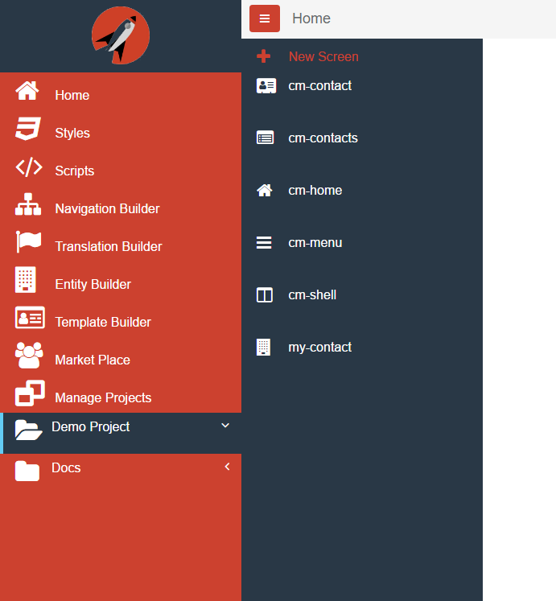

# Screens

After you have selected the project you want to work on, a second level menu will expand to the right that will show all the available screens for that project. The following is a screen shot of some screens for the Demo project:

When you hover over an existing screen in the second level menu, you will see several options become available to you:

1.   will open the screen for design.
2.   will start the process of deleting the screen.  You will be asked to confirm the deletion.
3.   will open a new tab of the browser and you will be able to see what the screen would actually look and behave like to a user.
4.   will open the Add/Edit/Clone screen dialog where you will essentially be creating a new screen with all the same settings, except name, as the source screen.
5.   will open the Add/Edit/Clone screen dialog where you can change certain settings for the scree.

## Add/Edit/Clone Screen Dialog

The following is a screen shot of the add/edit/clone dialog:

Every screen has a screen name, description, flag asking whether this is a Data Form, a screen icon and Tags. The icon is used on the designer. Currently the icons you can select from are from FontAwesome. When you select the Data Form checkbox, it allows you to quickly scaffold admin screens by creating a form with inputs corresponding to the data provided. It also provides for validation and several settings on how to control validation as well as showing a validation summary.

**Note:** The screen name and icon will show up on the sub-menu when you click on a given *Project* from the Navigation Menu. Therefore it is important that you provide meaningful names as well as a useful icon to help you remember.

## Custom Elements

It is possible to have any screen treated as a custom element from another screen design. Since we will be referencing all custom elements using the `require` syntax in HTML, it is recommended to use lowercase spelling and avoid spaces. 

You can also have your markup have bindings that are expected to be set on the custom element tag. This is accomplished by providing all of the bindable names by clicking the Settings tab in the designer and setting the names under the Bindables section.