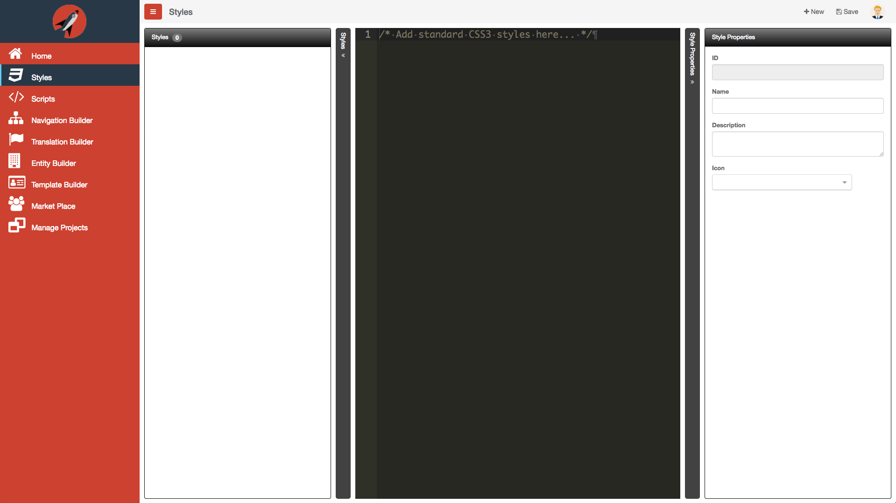
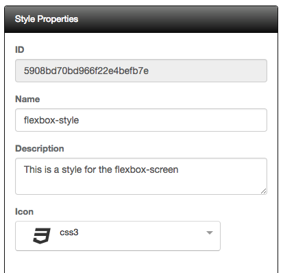
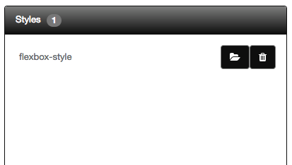
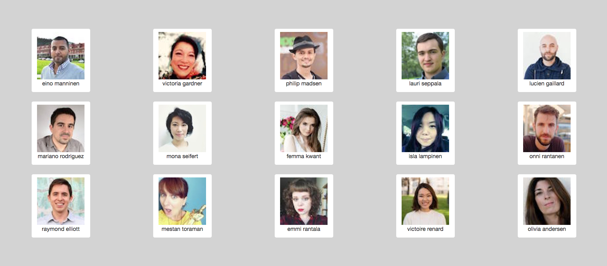

# Styles

You will find that sometimes it would be nice to author your own set of CSS rules. This is really easy using the Style editor. These styles can then be referenced from all of your screens in a project. The nice thing is that they will only be loaded once. The following is a screen shot of the styles editor:

## New Style

When the screen loads, you are in the context of a new style. You can simply start typing in the editor. You can collapse the dock-panes at any time. It is important to provide Style Properties prior to saving the style. 

* ID - this is readonly and simply represents the ID of this style
* Name - this is the name of the style 
* Description - this is just a general description of the style
* Icon - this is used to visually identify your style

The following is a screen shot of the Style Properties:

Let's now look at what the style looks like. The following is a screen shot of the style editor:

As you can see, we are simply creating standard CSS rules. When we save our script with the header's save  icon it will automatically be added to the Styles list on the left dock-pane as shown below:

## Edit Style

At any time, you can load any of the styles listed from the left dock-pane by clicking on the open folder  icon. Be sure to save any of your changes prior to loading a new style or they will be lost.

## Delete Style

It is also possible to remove any style by clicking the delete  icon next to the style you wish to delete in the script list. Deleting a style here will not remove the style reference in a given screen so take care when you remove a style. You will need to make sure any screen that referenced the given style is updated to a new style or the reference is removed.

## Referencing a Style from a screen

We have built our style and now want to use. Let's walk through how we can accomplish this. First, we will create a new screen called, `style-screen`. We will not add any elements to the screen but we will go to the Settings tab on the right dock-pane and select the style from the dropdown.

The following is a screen shot of the Settings tab in the designer showing `contact-manager-style` as a selected style:

Save your changes and then click on the Preview button to see your styles in action. The following is a screenshot of using the above style:

Refer to the [ REST API Screen Tutorial ](../../tutorials/randomuser-screen.md) for tutorial on using your own styles.
