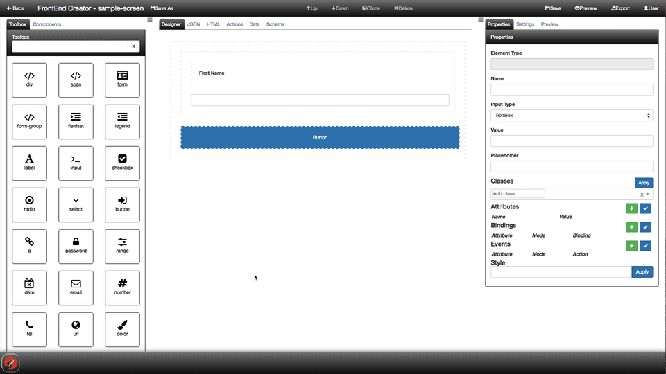
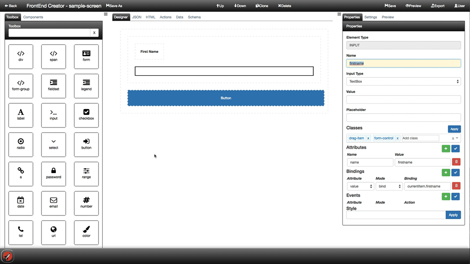
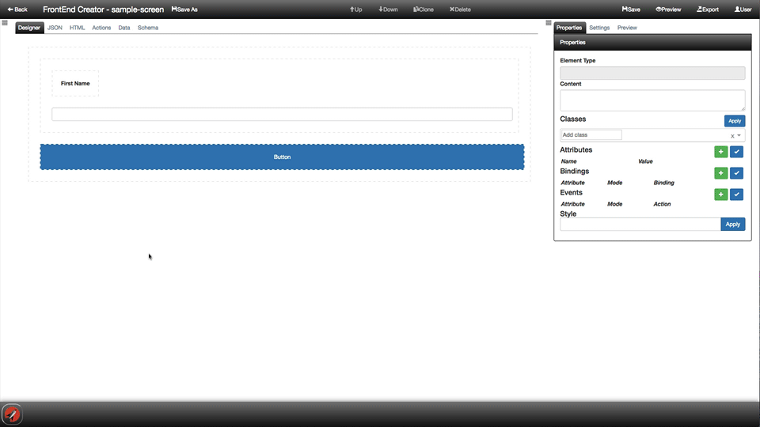

# Data Binding

If you are familiar with Aurelia, than data-binding should be pretty intuitive. However, don't worry if you haven't done this before. You will find that it is pretty easy with the property tab and the designer to get this accomplished.

The following animation demonstrates adding a binding to the value property of an input element:

After we have setup the binding, we can verify that it is working against object defined in our Data tab as well as see it live in the Preview tab or launching a new Preview browser tab.

**Remember** You must save to get the changes to be reflected in Preview.

### Steps

In the previous animations, you saw how we wired up the value attribute of the input element using the following command:

`value.bind="currentItem.firstname"`

We next need to ensure that we have an object named, "currentItem", that has a property named "firstname" off it.

We can see that we exactly this when we look at the Data tab here:

### Bindings

The Bindings section is used to define all of your bindings for a given element. It consists of three parts:

* **Attribute** - this is the attribute for which the binding is associated with, e.g. 'value'
* **Mode** - this is the type type of binding, e.g. 'bind', 'two-way', 'one-time', and 'one-way'
* **Binding** - this is the binding expression

You have the ability to add or remove as many bindings as you like. You must click on the blue check button to apply your changes to the element. 

The following is a screen shot of the bindings section:

## Event Handling

The next animation shows adding a click event to a button:

After we have setup the click event, we can verify that it is working against a function in our Actions tab as well as see it live in the Preview tab or launching a new Preview browser tab.

**Remember** You must save to get the changes to be reflected in the Preview.

### Steps

In the previous animations, you saw how we wired up the click event on the button element using the following command:

`click.delegate="actions.sample()"`

We next need to ensure that we have an function named, "sample", in the Actions tab.

We can see that we exactly this when we look at the Actions tab here:

### Events

The Events section is used to define all of your event handlers for a given element. It consists of three parts:

* **Attribute** - this is the attribute for which the event handler is associated with, e.g. 'click', 'keydown', 'change', etc.
* **Mode** - this is how the event is raised, e.g. 'delegate', 'trigger', or 'call'
* **Action** - this is the function reference that will be called when the event is raised

You have the ability to add or remove as many events as you like. You must click on the blue check button to apply your changes to the element. 

The following is a screen shot of the events section:

