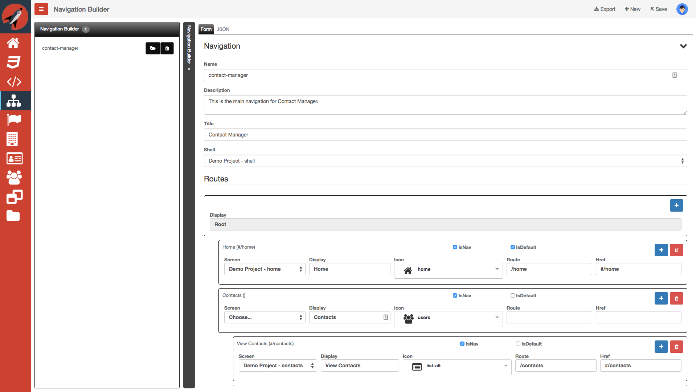
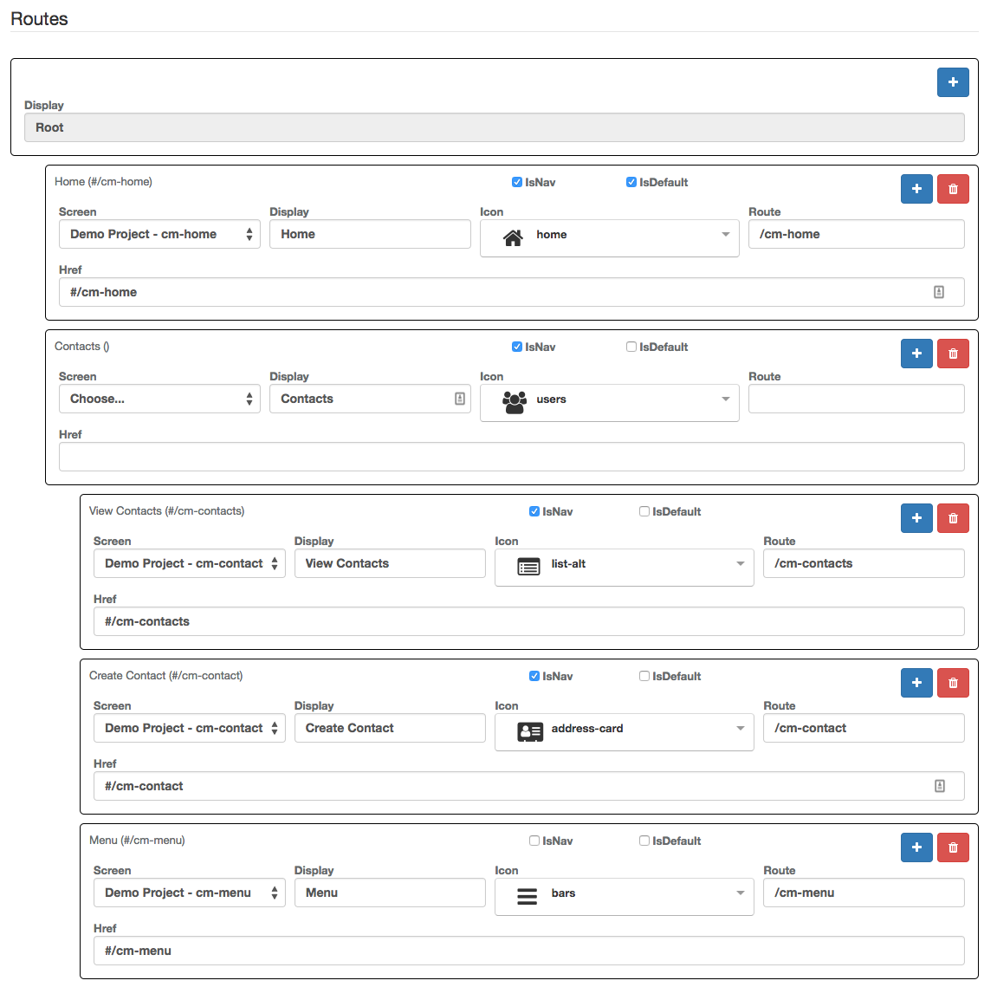
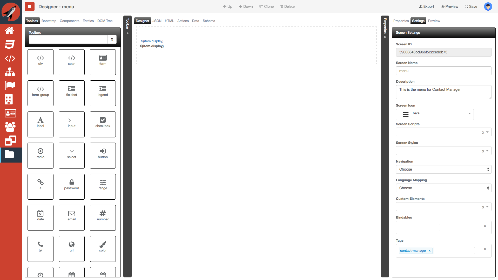
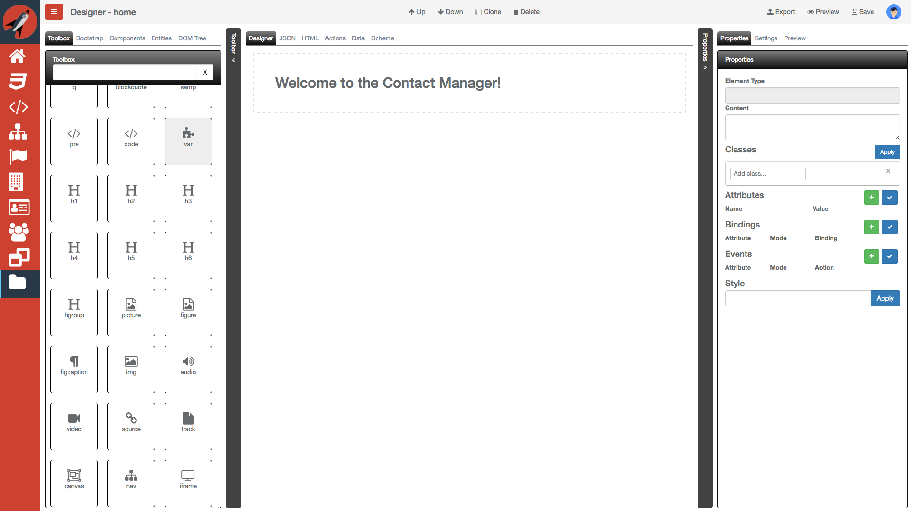
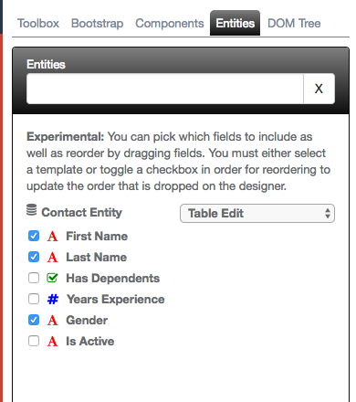
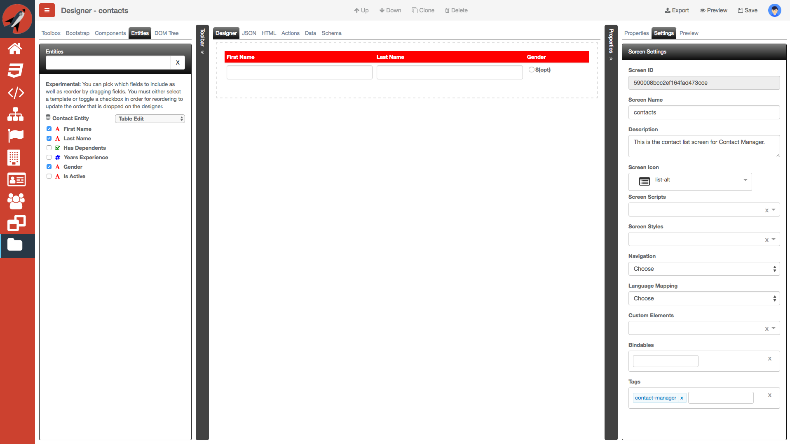
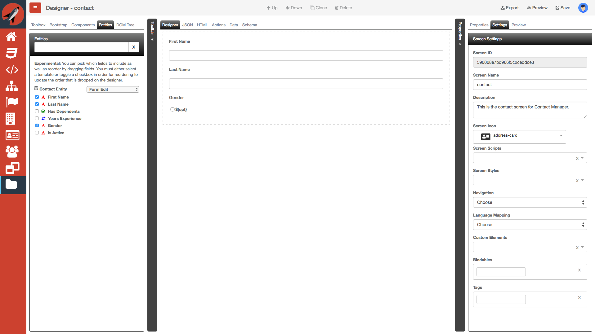

# Navigation Builder

**WARNING: THIS DOCUMENT IS STILL UNDER CONSTRUCTION** 

**PLEASE WAIT UNTIL THIS WARNING HAS BEEN REMOVED TO TRY TO FOLLOW ANY STEPS PROVIDED**


The navigation builder allows you to define your overall routes for your application. Although the navigation builder allows you to create hierarchical menus, it will always be flattened out when in order to define a set of routes that correspond to all screens in a given navigation.



Let's first go over all of the components of the navigation builder. The navigation builder has the following properties:


- Name - this is the name of the navigation. If you plan on exporting an application using the navigation builder, then this is going to be the name of the .zip file downloaded
- Description - this is the description of the navigation
- Title - this is the title used in the `configureRouter` function to set the title of the application
- Shell - this allows you to pick a top level container. Typically, this is a screen that container a `router-view` custom element
- Routes - this hierarchy allows you to define routes as well as labels so that you can use this for you main menu as well as defining all of the routes in the `configureRouter` function

You have the following actions that you can perform on a navigation:

- Export - after you have all of your screens ready and a navigation with corresponding routes, you can export the application to your local file system. Please refer to the [ Application Export ](application-export) document for guidance on running your application locally
- New - this allows you to create a new navigation. The mnemonic to execute this button is `Ctrl|Cmd + Plus`
- Save - this allows you to save your current navigation. The mnemonic to execute this button is `Ctrl|Cmd + S`
- Load - this allows you to load an existing navigation
- Delete - this allow you to delete an existing navigation
- Add new route - this allows you to add a new route at the level where the button is clicked
- Delete route - this allows you to remove a route and all children at the level where the button is clicked

Let's now take a look at the fields that make up an individual route: 



- IsNav - this is a checkbox that determines if the route should be visible when creating a menu from the router
- IsDefault - this indicates which of the routes is identified as the default route. **Note:** currently, you can check all routes with this value. Only one route should ever have this selected
- Screen - this is a dropdown that lists all of your screens across all projects. You may have projects where you have created screens or dialogs that are common across all applications
- Display - this is what is display in the menu
- Icon - this is an icon that can be used for display in the menu or the screen. This defaults to the icon selected when creating the screen
- Route - this is the route for the router. It defaults to the name of the screen
- Href - this is the href for the router. It may not be necessary. It defaults to the name of the screen

As you can see from the screenshot above, we have a hierarchical menu representation that we want our application to use. You will also notice that we have a `Contacts` route entry that is not a screen but a parent to children. In this way, the `Contacts` entry is ignored in the router but is present in the menu. 

You will also notice that we have an entry that is not included with the IsNav checkbox. This is due to the fact that the menu screen is not a route. We include it here so that when we export it is included as the list of screens to include.

## Contact Manager - Quick Start
Okay, let's take a stab of creating our own application. The following is a screenshot of the final product that we are going to build:


### Styles

We are going to need to create a single styles sheet so that we can reference it from our screens:

1. Navigate to the Styles screen and create a new style and call it `contact-manager-style`
2. In the Styles editor, add the following CSS:
  ```css
  :root {
    --page-bg-color: #fff;
    --page-color: #676a6c;
    --page-border-color: lightgray;
    --menu-bg-color: #33691E;
    --menu-active-bg-color: #1B5E20;
    --menu-active-border-color: #9CCC65;
    --menu-item-color: #E0E0E0;
    --menu-item-active-color: #9CCC65;
  }

  html, body, .page-host {
    height: 100%;
    margin: 0;
  }

  .cm-page {
    background-color: var(--page-bg-color);
    color: var(--page-color);
    padding: 15px;
    margin: 20px;
    border: 1px solid var(--page-border-color);
    box-shadow: 5px 5px 5px var(--page-border-color);
  }
  .cm-menu-background {
    background-color: var(--menu-bg-color);
  }
  .cm-menu {
    margin:0;
    padding:0;
    background-color: var(--menu-bg-color);
    padding-left: 15px;
  }
  .cm-menu-item {
    border-left: 4px solid transparent;
    color: var(--menu-item-color);
  }
  .cm-menu-item a,
  .cm-menu-item label {
    padding: 7px 15px;
    display: block;
    text-decoration: none;
    font-weight: 600;
  }
  .cm-menu-item a {
    color: var(--menu-item-color);
  }
  .cm-menu-item:hover,
  .cm-menu-item:hover>a,
  .cm-menu-item:hover>div>a,
  .cm-menu-item:hover>div>label {
    background: var(--menu-active-bg-color);
    color: var(--menu-item-active-color);
  }
  .cm-menu > .parent-active {
    border-left: 4px solid var(--menu-active-border-color);
    background: var(--menu-active-bg-color);
  }
  .cm-menu .item-active,
  .cm-menu .item-active > a,
  .cm-menu .item-active > label {
    color: var(--menu-item-active-color);
  }
  .cm-menu .item-active,
  .cm-menu .item-active * {
    background: var(--menu-active-bg-color);
  }
  /* animate page transitions */
  .au-enter-active {
    -webkit-animation: fadeInRight 1s;
    animation: fadeInRight 1s;
  }

  /* animation definitions */
  @-webkit-keyframes fadeInRight {
    0% {
      opacity: 0;
      -webkit-transform: translate3d(100%, 0, 0);
      transform: translate3d(100%, 0, 0)
    }
    100% {
      opacity: 1;
      -webkit-transform: none;
      transform: none
    }
  }

  @keyframes fadeInRight {
    0% {
      opacity: 0;
      -webkit-transform: translate3d(100%, 0, 0);
      -ms-transform: translate3d(100%, 0, 0);
      transform: translate3d(100%, 0, 0)
    }
    100% {
      opacity: 1;
      -webkit-transform: none;
      -ms-transform: none;
      transform: none
    }
  }
  ```
  You will notice that we are using some CSS3 variables. They should be support in all browsers.

Now, let's move on and create our screens. We are going to prefix all of our screens just to be sure that we don't have a naming collision with the default HTML elements.

From the navigation screenshot above, we are going to need to create five (5) screens:

- menu - this will be the application menu and will live in the shell
- shell - this will be our shell for the application. It will contain the custom element `router-view`
- home - this is our home screen
- contacts - this will display a list of contacts in a table
- contact - this will allow us to edit an individual contact


### Menu screen

1. Create another screen and call it, `cm-menu`
2. In the designer, add the following HTML:
  ```html
  <ol class="cm-menu tree flex-column-1 drag-container drag-item padding-top-15">
    <li repeat.for="item of navigation" title="${item.display}" class="cm-menu-item">
      <a if.bind="item.routes.length == 0" href.bind="item.href" class="user-select-none">
        <i if.bind="item.icon" class="fa fa-${item.icon} fa-2x margin-right-10 pointer-events-none"></i>
        <span class="pointer-events-none">${item.display}</span>
      </a>
      <div if.bind="item.routes.length > 0" class="">
        <label for="${item.id}" class="cm-menu-label user-select-none">
          <div class="flex-row-1">
            <i class="flex-row-none fa fa-${item.icon} fa-2x margin-right-10 pointer-events-none"></i>
            <span class="flex-row-1 pointer-events-none">${item.display}</span>
            <i class="cm-menu-caret fa ${inputCheck.checked ? 'fa-angle-down' : 'fa-angle-left'} pointer-events-none"></i>
          </div>
        </label>
        <input ref="inputCheck" type="checkbox" id="${item.id}" class="cm-menu-parent pointer-events-none">
        <ol class="cm-sub-menu flex-column-1">
          <li show.bind="sub.nav" class="cm-menu-item field user-select-none" repeat.for="sub of item.routes">
            <a href.bind="sub.href" class="user-select-none">
              <i if.bind="sub.icon" class="fa fa-${sub.icon} fa-lg margin-right-10 pointer-events-none"></i>
              <span class="pointer-events-none">${sub.display}</span>
            </a>
          </li>
        </ol>
      </div>
    </li>
  </ol>
  ```
  Here is how the designer should appear:

  

  As you can see, you really cannot see much from the designer perspective as the menu is really data-driven.

3. In the settings tab, make sure that you include `contact-manager` under the Navigation field. It uses the navigation object to create the menu dynamically
4. Save your screen

### Shell screen

1. Create a new screen and call it `cm-shell`
2. In the settings tab, make sure you include `contact-manager-styles` under the Screen Styles field
3. Also, make sure that you include `cm-menu` under the Custom Elements field
4. In the designer, add the following HTML:
  ```html
  <div class="drag-container drag-item flex-row full-height">
    <require from="cm-menu"></require>

    <sidebar class="flex-column-1 min-max-width-300">
      <cm-menu class="flex-column-1"></cm-menu>
    </sidebar>
    <main class="drag-container drag-item flex-column-1">
      <router-view swap-order="after" class="flex-column-1"></router-view>
    </main>
  </div>
  ```
  As you can see from above, we have a simple shell that has two columns. It also contains a reference to our `cm-menu` screen as a custom element. Finally, we also are referencing the `router-view` Aurelia custom element. Here is how the designer should appear:

  

5. In the actions tab, add the following JavaScript:
  ```javascript
  function (that, V) {
    
    function attached() {
      that.cmMenu = document.querySelector(".cm-menu");
      that.cmMenu.addEventListener("click", that.actions.activateLink.bind(that));
    }
    
    function detached() {
      that.cmMenu.removeEventListener("click", that.actions.activateLink.bind(that));
    }

    function activateLink(e) {
      console.log('shell:activateLink', e);
      if (e.target.nodeName === "OL") return;
      let cls = that.cmMenu.querySelectorAll(".item-active, .parent-active");
      if (cls) {
        cls.forEach(item => {
          item.classList.remove("item-active");
          item.classList.remove("parent-active");
        });
      }
      if (e.target.nodeName === "INPUT") {
        e.target.parentElement.classList.add("item-active");
      } else {
        e.target.classList.add("item-active");
      }

      let parent = that.actions.findChildWithParentClass(e.target, "cm-menu");
      if (parent) {
        parent.classList.add("parent-active");
      }
      return true;
    }
    
    function findChildWithParentClass(target, cls) {
      let node = target;
      while (node.parentElement != null) {
        if (node.parentElement.classList.contains(cls)) return node;
        node = node.parentElement;
      }
      return null;
    }
    
    return {
      attached: attached,
      detached: detached,
      activateLink: activateLink,
      findChildWithParentClass: findChildWithParentClass
    };
  }
  ```
6. Save your screen

### Home screen

1. Create another screen and call it, `cm-home`
2. In the designer, add the following HTML:
  ```html
  <section class="cm-page flex-column-1 au-animate drag-container drag-item">
    <h2 class="drag-container drag-item">
      Welcome to the Contact Manager!
    </h2>
  </section>
  ```
  Here is how the designer should appear:

  

3. Save your screen

### Contacts screen

1. Create another screen and call it, `cm-contacts`
2. In the designer use the Entities tab and select the Contact entity. Check the fields as shown below as well as pick `Table Edit` from the dropdown and drag onto the designer

  

  Here is how the designer should appear:

  

3. You will want to modify the HTML slightly by wrapping existing markup with the following section element:
  ```html
  <section class="cm-page flex-column-1 au-animate drag-container drag-item">
    ...
  </section>
  ```
4. By wrapping the markup, we are able to automatically enlist into Aurelia's CSS animation
5. In the data tab, add the following JSON:
  ```json
  {
    "genderList": [
      "male",
      "female"
    ]
  }
  ```
  We do this so that the radio options are created properly.

6. Save your screen

### Contact screen

1. Create another screen and call it, `cm-contact`
2. In the designer, use the Entities tab and select Contact Entity. Check the fields as shown below as well as pick `Form Edit` from the dropdown and drag onto the designer

  Here is how the designer should appear:

  

3. You will want to modify the HTML slightly by wrapping existing markup with the following section element:
  ```html
  <section class="cm-page flex-column-1 au-animate drag-container drag-item">
    ...
  </section>
  ```
4. By wrapping the markup, we are able to automatically enlist into Aurelia's CSS animation
5. In the data tab, add the following JSON:
  ```json
  {
    "genderList": [
      "male",
      "female"
    ]
  }
  ```
  We do this so that the radio options are created properly.

6. Save your screen

## Testing your application

We are now ready to test the application. It should look like the application from animation at the beginning of the Quick Start.

In order to test your application, you will need to construct a URL that points to your application. You can achieve this by using the following steps:

`http://frontendcreator.com/editor/0.9.14/?app=<navigationID>&db=frontendcreator`

- You will need to replace the `navigationID` with the ID property from the Navigation screen. Currently, you can acces it by copying it from the JSON tab.
- Also note, that the version of the editor may have changed.

## Uh, there's no data...

We have come a long ways but we still need to have data. This next section will get you setup with some random data for testing.

### RandomUser script

1. Create a new Script and call it, `RandomUser`
2. Add the following JavaScript to the editor:
  ```javascript
  @inject(HttpFetchClient)
  class RandomUser {
    constructor(http) {
      this.http = http;
      this.baseUrl = `https://randomuser.me/`;
      this.http.configure(config => {
        config
          .withBaseUrl(this.baseUrl)
          .withDefaults({
            headers: {
              'Accept': 'application/json',
              'X-Requested-With': 'Fetch'
            }
          });
      });
    }

    getUsers(numberUsers = 10) {
      let path = `api?nat=us&results=${numberUsers}`;
      return this.http.fetch(path)
        .then(response => response.json());
    }
  }

  ``` 

  This uses the HTTP Fetch client to grab data from the `randomuser.me` address. We will use this script in the Contacts screen.
3. Save your script

### Contacts screen

1. Load the `cm-contacts` screen
2. In the settings tab, make sure you include `RandomUser` under the Screen Scripts field
3. In the actions tab, add the following JavaScript:
  ```javascript
  function (that, V) {
    function attached() {
      that.randomUser = that.classBuilder(that.Script.RandomUser,
        that.Script.RandomUser_inject);
      return that.randomUser.getUsers(5)
        .then(data => {
          let map = data.results.map((r,i) => {
            return { 
              id: i,
              firstName: r.name.first,
              lastName: r.name.last,
              gender: r.gender
            };
          });
          that.data = map;
        });
    }
    
    return {
      attached: attached
    };
  }
  ```
4. Save your screen


[ <- Previous ](entity-builder) | [ Home ](home) | [ Next -> ](application-export)
