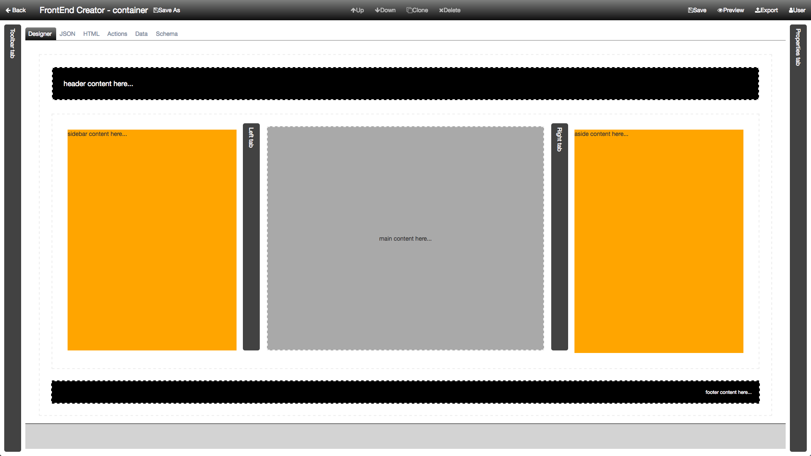
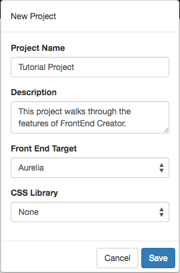
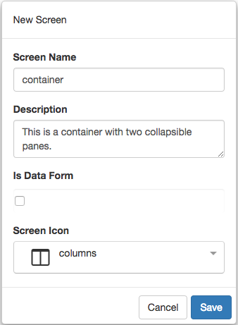
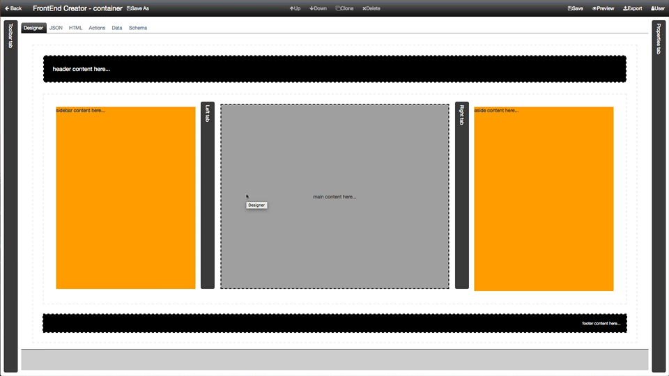

#Tutorial - Container with collapsible Panes, Part 1

The following are the steps required to use **FrontEnd Creator** to create a dock container using Flexbox. This is part 1 in a three-part series. We will create a dock container in this first tutorial. The container will have two collapsible panes. Here is a screen shot of the layout we are going to build:




Let's get started.

1. Start by creating a project called, `Tutorial Project`. Add any description and left the rest of the properties with their default values. Your screen should look like the following:

  

2. Once you click save, you will go to the Project Dashboard. We will go straight to the screens.

  

3. Click on the plus button to add a new screen.

  

4. Now we are ready to start building our layout. Click on the HTML tab and replace the following snippet in the editor. 

  ```html
  <div class="drag-container drag-item holy-grail flex-column full-height">
    <style>
      .holy-grail header { background-color: black; color: white; }
      .holy-grail sidebar { background-color: orange; }
      .holy-grail article { background-color: darkgray; }
      .holy-grail aside { background-color: orange; }
      .holy-grail footer { background-color: black; color: white; }
    </style>
    <header class="drag-container drag-item flex-row-none padding-10">
      header content here...
    </header>
    <main class="drag-container drag-item flex-row-1">
      <sidebar tag="left-pane" class="flex-row-1 min-max-width-400 margin-15" id="sidebar-tab">
        sidebar content here...
      </sidebar>
      <div tag="tab-header" class="flex-none tab-header margin-right-10 width-40" click.delegate="actions.toggleSidebar()">
        <span class="vertical-text">Left tab</span>
      </div>
      <article class="drag-container drag-item flex-row-3 align-items-center justify-content-center">
        main content here...
      </article>
      <div tag="tab-header" class="flex-none tab-header margin-left-10 width-40" click.delegate="actions.toggleAside()">
        <span class="vertical-text">Right tab</span>
      </div>
      <aside tag="right-pane" class="flex-row-1 min-max-width-400 margin-15" id="aside-tab">
        aside content here...
      </aside>
    </main>
    <footer class="drag-container drag-item flex-row-none justify-content-end padding-10">
      footer content here...
    </footer>
  </div>
  ```

  Before we move on, notice how we are using inline styles to help us with styling this page. We could have taken this further and replaced some of the classes that we have on the elements. Just remember that you can do this either by setting the style attribute on the element itself or by providing some CSS. Both of these approaches do no require any interpolation or bindings.

  Here is a recap of each of the elements that were added and settings. In each element we set specific classes and styles. The following is a breakdown for each element:

  Element | Host | Class 
  --- | --- | --- |---
  DIV |  | flex-column full-height
  HEADER | DIV | flex-row-none
  MAIN | DIV | flex-row-1
  SIDEBAR | MAIN | flex-row-1 min-max-width-400 margin-15
  DIV | MAIN | flex-none tab-header margin-right-10 width-40
  DIV | DIV | vertical-text
  ARTICLE | MAIN | flex-row-3 align-items-center justify-content-center
  DIV | MAIN | flex-none tab-header margin-left-10 width-40
  DIV | DIV | vertical-text
  ASIDE | MAIN | flex-row-1 min-max-width-400 margin-15
  FOOTER | DIV | flex-row-none justify-content-end

  Element | Host | Content
  --- | --- | ---
  DIV |  |  
  HEADER | DIV | header content here...
  MAIN | DIV | 
  SIDEBAR | MAIN | sidebar content here...
  DIV | MAIN | 
  DIV | DIV | Left tab
  ARTICLE | MAIN | main content here...
  DIV | MAIN | 
  DIV | DIV | Right tab
  ASIDE | MAIN | aside content here...
  FOOTER | DIV | footer content here...


  ## Events
  The following are the events on the elements:

  Element | Attribute | Mode | Action
  --- | --- | --- |---
  DIV | click | delegate | actions.toggleSidebar() 
  DIV | click | delegate | actions.toggleAside() 

5. Save you work.

6. Click the Actions tab and enter the following code:

  ```javascript
  function (that, V) {

    function toggleSidebar() {
        var sb = document.querySelector('#sidebar-tab');
        if (sb && sb.classList.contains('close-tab')) {
          sb.classList.remove('close-tab');      
        } else {
          sb.classList.add('close-tab');      
        }
      }
     
     function toggleAside() {
        var sb = document.querySelector('#aside-tab');
        if (sb && sb.classList.contains('close-tab')) {
          sb.classList.remove('close-tab');      
        } else {
          sb.classList.add('close-tab');      
        }
      }
    
   return {
      toggleSidebar: toggleSidebar,
      toggleAside: toggleAside
    };
  }
  ```

7. Save your work.

8. Click on the Preview button and you should see something like the following:

  

That it! You have completed part 1! Congratulations!

[ Tutorials ](tutorials/tutorials) | [ Next -> ](container-part-2)
