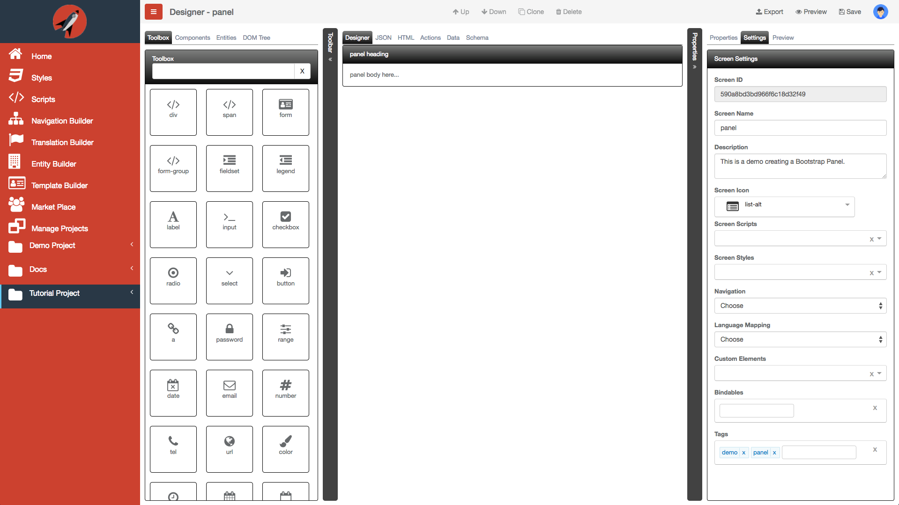
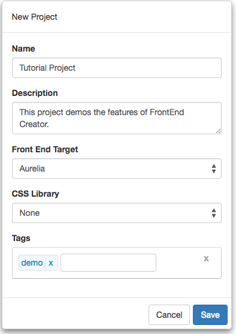
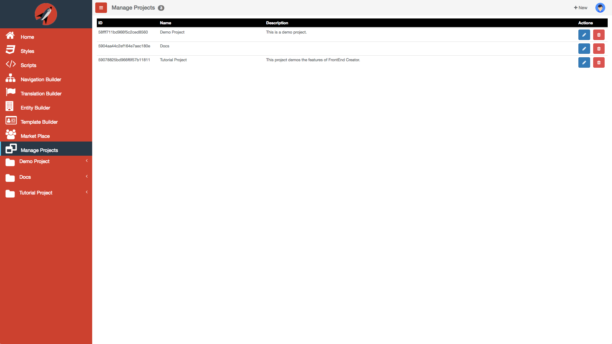
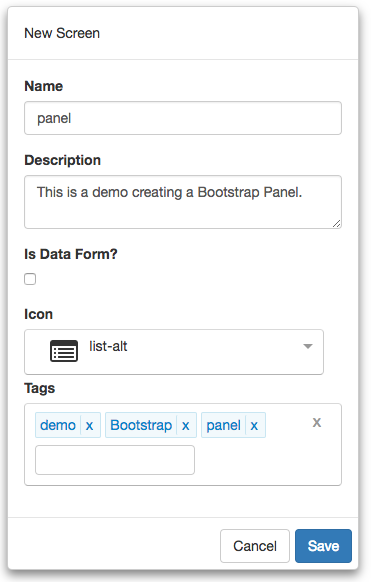

#Tutorial - Container with collapsible Panes, Part 2

In this part, we are going to create a Bootstrap Panel. These panels will be used in the third and final part of this series. Here is a screen shot of the layout we are going to build:



Let's get started.

1) Start by clicking on *Manage Projects* from navigation menu on the left pane.


2) Next, click on the New button and name the project, `Tutorial Project`. Add any description and leave the rest of the properties with their default values. You can add any tags you like to the project. Your should have something that looks like the following:



3) Once you click save, will notice that the project will automatically be added to the Manage Projects table as well as the navigation menu on the left:



4) Next, click on the Tutorial Project menu item from the navigation menu and select New Screen:


5) Name the screen, `container`. Add any description and pick any icon you wish for the screen. You can add any tags you like to the screen. You should have something that looks like the following:



6) Now we are ready to start building our layout. Click on the HTML tab and replace the following snippet in the editor. 

```html
<div class="panel panel-black flex-column-1 overflow-auto">
  <div class="panel-heading">panel heading</div>
  <div class="panel-body">
    panel body here...
  </div>
</div>
```

This one is pretty straight forward. We are using Bootstrap classes to build our Panel.


  https://youtu.be/6m02xAGkOLc


Here is a recap of each of the elements that were added and settings. 

Here is a recap of each of the elements that were added and settings. In each element we set specific classes and styles. The following is a breakdown for each element:

###Element Classes
The following is a breakdown for each element on the screen with its corresponding *class* values:

Element | Host | Class 
--- | --- | --- |---
DIV |  | panel panel-black flex-column-1 overflow-auto
DIV | DIV | panel-heading
DIV | DIV | panel-body

###Element Content
The following is a breakdown for each element on the screen with its corresponding *content* values:

Element | Host | Content
--- | --- | ---
DIV | DIV | panel heading
DIV | DIV | panel body here...


7) Save you work.

8) Click on the Preview button and you should see something like the following:


That it! You have completed part 2! Congratulations!
