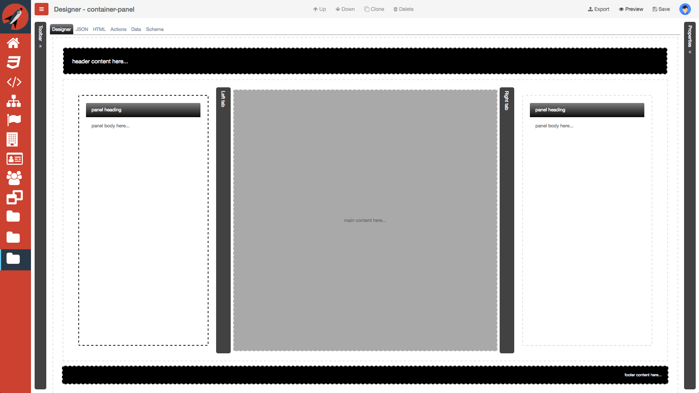
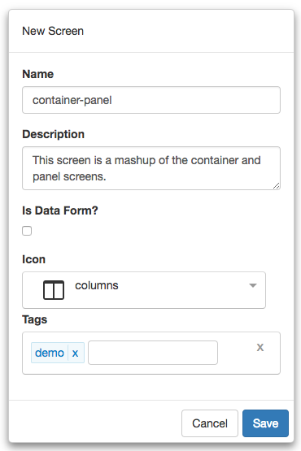

#Container Tutorial - Part 3 Composition

So far, we have built two separate components. We have a container with sliding panes and we now have a panel. In this tutorial, we are going to bring it all together by using composition and build out our container now with the panels included. Here is a screen shot of the layout we are going to build:

Let's get started.

1) Start by clicking on *Manage Projects* from navigation menu on the left pane.

2) Next, click on the New button and name the project, `Tutorial Project`. Add any description and leave the rest of the properties with their default values. You can add any tags you like to the project. Your should have something that looks like the following:

3) Once you click save, will notice that the project will automatically be added to the Manage Projects table as well as the navigation menu on the left:

4) Next, click on the Tutorial Project menu item from the navigation menu and select New Screen:

5) Name the screen, `container-panel`. Add any description and pick any icon you wish for the screen. You can add any tags you like to the screen. You should have something that looks like the following:

6) Now we are ready to start building our layout. Click on the HTML tab and replace the following snippet in the editor. 

7) The next steps is best shown with video and audio. We will simply be dragging our two previously created components and adjusting a few minor settings. Follow the steps in the video here then come back and continue:


  https://youtu.be/B6M1p2ZV0xE


8) Save you work.

9) Click on the Preview button and you should see something like the following:

That's it! You have completed part 3! Congratulations!
