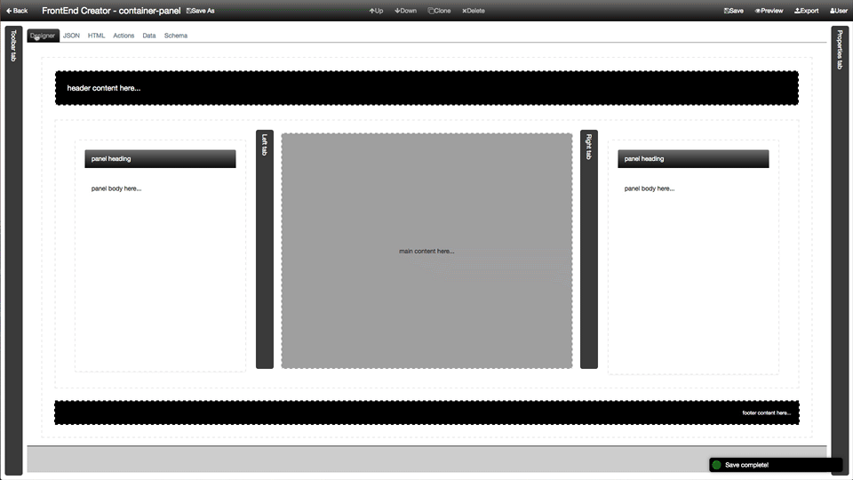

#Container Tutorial - Part 4 Custom Elements

In the previous tutorial, we created our `container-panel` using composition. This time through, we are going to create a container that uses Custom Elements. Here is a screen shot of the layout we are going to build:

Let's get started.

1) Start by clicking on *Manage Projects* from navigation menu on the left pane.

2) Next, click on the New button and name the project, `Tutorial Project`. Add any description and leave the rest of the properties with their default values. You can add any tags you like to the project. Your should have something that looks like the following:

3) Once you click save, will notice that the project will automatically be added to the Manage Projects table as well as the navigation menu on the left:

4) Next, click on the Tutorial Project menu item from the navigation menu and select New Screen:

5) Name the screen, `container-host`. Add any description and pick any icon you wish for the screen. You can add any tags you like to the screen. You should have something that looks like the following:

6) Now we are ready to start building our layout. The following video will walk you through the steps required to compose the screen:


  https://youtu.be/B6M1p2ZV0xE


We will simply be dragged the `container` and `panel` components onto the designer. We also adjusted some content as well as removed some `background-color` styles.

**Note:** Although, this is powerful and allows you to compose your screens together quickly, it lacks the ability to reference the `container` and `panel` as custom elements. In the next tutorial, we will look at an alternative route to building this out using custom elements.

8) Save you work.

9) Click on the Preview button and you should see something like the following:

That's it! You have completed part 3! Congratulations!
