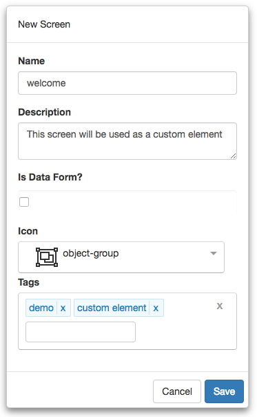
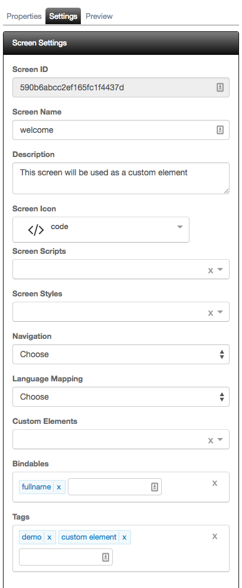
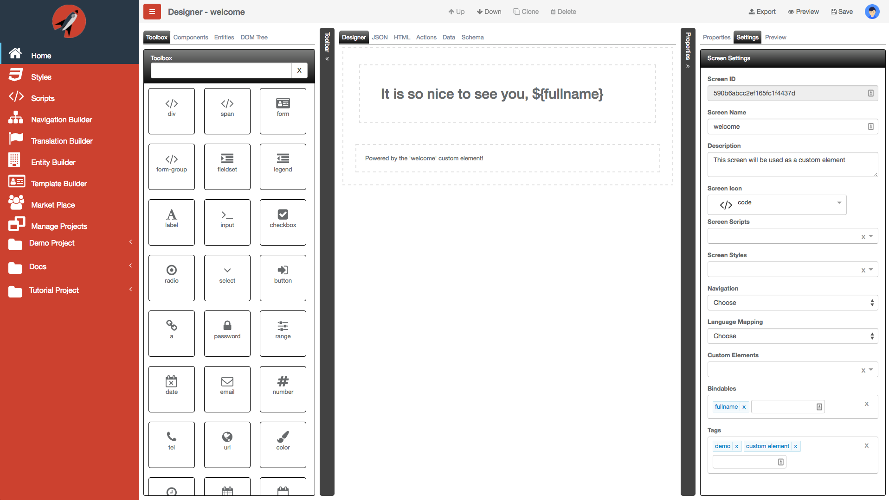
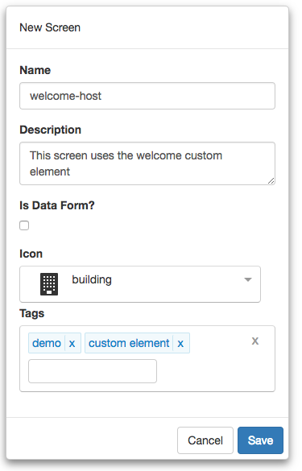
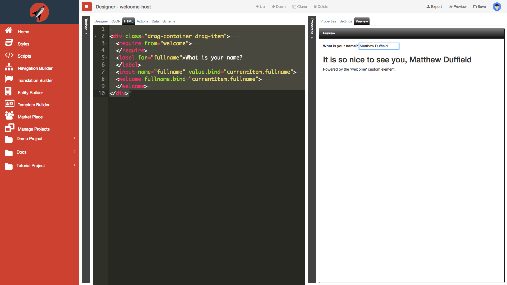

#Custom Element Tutorial

The following are the steps required to use **FrontEnd Creator** and build a `welcome` screen as a custom element. We will then create a `welcome-host` that will use the `welcome` screen as a custom element as well as passing bindings on the `welcome` tag.


  https://youtu.be/Ty6GIQjAuEE


Let's get started.

1) Start by clicking on *Manage Projects* from navigation menu on the left pane.


2) Next, click on the New button and name the project, `Tutorial Project`. Add any description and leave the rest of the properties with their default values. You can add any tags you like to the project. Your should have something that looks like the following:


3) Once you click save, will notice that the project will automatically be added to the Manage Projects table as well as the navigation menu on the left:


4) Next, click on the Tutorial Project menu item from the navigation menu and select New Screen:


5) Name the screen, `welcome`. Add any description and pick any icon you wish for the screen. You can add any tags you like to the screen. You should have something that looks like the following:



11) Clicking save will navigate you to the designer.

12) Under the *Settings* tab, type in `fullname` under the Bindables section and hit *enter*.



13) Save your work.

14) We are now ready to start building our layout. This will be very simple markup.

```html
<div class="drag-container drag-item">  
  <h2 class="drag-container drag-item">It is so nice to see you, ${fullname}  
  </h2>  
  <p class="drag-container drag-item">Powered by the 'welcome' custom element!  
  </p>
</div>
```

As you can see from the markup, we have only single part that is dynamic. We are expecting to find a property `fullname` for string interpolation. This is the reason for exposing the Bindable under our Settings tab.

15) Save your work.

16) The following is what your your screen should look like:



17) Okay, we are now ready to work on our next screen.

18) Next, click on the Tutorial Project menu item from the navigation menu and select New Screen:


19) Name the screen, `welcome-host`. Add any description and pick any icon you wish for the screen. You can add any tags you like to the screen. You should have something that looks like the following:



20) Clicking save will navigate you to the designer.

21) Under the *Settings* tab, select `welcome` under the Custom Elements section.


22) Save your work.

23) We are now ready to start building our layout. This will be very simple markup.

```html
<div class="drag-container drag-item">  
  <require from="welcome">  
  </require>  
  <label for="fullname">What is your name?  
  </label>  
  <input name="fullname" value.bind="currentItem.fullname">  
  <welcome fullname.bind="currentItem.fullname">  
  </welcome>
</div>
```
As you can see, we using the `require` tag to bring in our `welcome` custom element. Next, we are creating a binding on an input element so that we can demonstrate that the binding on `welcome` is dynamic.

24) Save your work.

25) Here is a screenshot of `welcome` custom element being used by the `welcome-host` screen:



26) Congratulations! You have finished this tutorial!!
