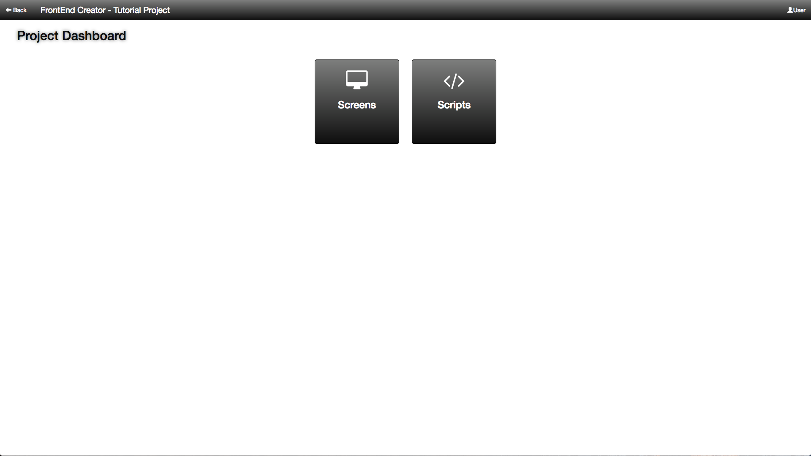

#Flexbox Screen Tutorial

Layout has always been a challenge with CSS forcing you to write an enormous amount of CSS or rely on a third-party library. Flexbox is one of the recent new kids that has made type of work easier with very minimal CSS. In this tutorial, we will be building the following layout, sometimes known as the holy grail in layout.

Let's get started.

1. Start by creating a project called, `Tutorial Project`. Add any description and left the rest of the properties with their default values. Your screen should look like the following:

  

2. Once you click save, you will go to the Project Dashboard. We will go straight to the screens.

  

3. Click on the plus button to add a new screen.

  

4. Now we are ready to start building our layout. There are a total of seven elements that we will use. We will create each individually using an animation that you can follow along.

  

Here is a recap of each of the elements that were added and settings. In each element we set specific classes and styles. The following is a breakdown for each element:

Element | Host | Class | Style
--- | --- | --- |---
DIV |  | flex-column full-height | 
HEADER | DIV | flex-row-none | background-color: lightblue;
MAIN | DIV | flex-row-1 | 
SIDEBAR | MAIN | flex-row-1 justify-content-center | background-color: orange;
ARTICLE | MAIN | flex-row-3 align-items-center justify-content-center | background-color: cornsilk;
ASIDE | MAIN | flex-row-1 | background-color: mistyrose;
FOOTER | DIV | flex-row-none justify-content-end | background-color: lightgreen;

5. Save you work.

6. Click on the Preview button and you should see your layout like the following:

That it! You have created your first Flexbox layout! Congratulations!

[ Tutorials ](tutorials/tutorials)
