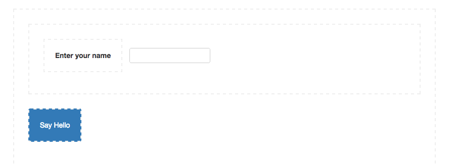
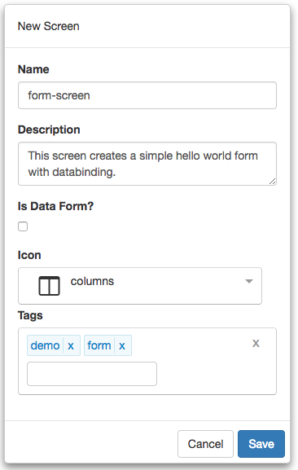
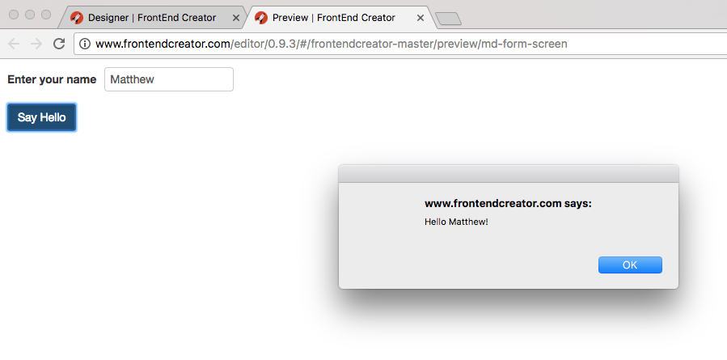

#Form Screen Tutorial

The following are the steps required to use **FrontEnd Creator** to create a simple hello world form with databinding. Here is a screen shot of the layout we are going to build:




Let's get started.

1) Start by clicking on *Manage Projects* from navigation menu on the left pane.


2) Next, click on the New button and name the project, `Tutorial Project`. Add any description and leave the rest of the properties with their default values. You can add any tags you like to the project. Your should have something that looks like the following:


3) Once you click save, will notice that the project will automatically be added to the Manage Projects table as well as the navigation menu on the left:


4) Next, click on the Tutorial Project menu item from the navigation menu and select New Screen:


5) Name the screen, `form-screen`. Add any description and pick any icon you wish for the screen. You can add any tags you like to the screen. You should have something that looks like the following:



6) Clicking save will navigate you to the designer.

7) We are now ready to start building our layout. There are a total of five elements that we will use. We will create each individually using a video that you can follow along.


  https://www.youtube.com/watch?v=z-4SzNHKqRE


Here is a recap of each of the elements that were added and settings. In each element we set specific classes and styles. The following is a breakdown for each element:

Element | Host | Class | Content
--- | --- | --- |---
FORM |  | full-height padding-15 | 
FORM-GROUP | FORM | form-group | 
LABEL | FORM-GROUP | margin-right-10 | Enter your name
INPUT | FORM-GROUP |  | 
BUTTON | FORM | btn btn-primary | Say Hello

## Bindings
The following are the bindings on the elements:

Element | Attribute | Mode | Action
--- | --- | --- |---
INPUT | value | bind | currentItem.name

## Events
The following are the events on the elements:

Element | Attribute | Mode | Action
--- | --- | --- |---
BUTTON | click | delegate | actions.sayHello()

8) Save you work.

9) Click the Actions tab and enter the following code:

```javascript
function (that, V) {

  function sayHello(e) {
    alert(`Hello ${that.currentItem.name}!`);
  }

 return {
    sayHello: sayHello
  };
}
```

> #### info::
> We use `that` as a reference to the parent view model.

10) Save your work.

11) Click the Data tab and enter the following JSON:

```json
{
  "currentItem": {
    "name": ""
  }
}
```

12) Save your work.

13) Click on the Preview button and you should see something like the following:



That's it! You have created your first form with bindings! Congratulations!

