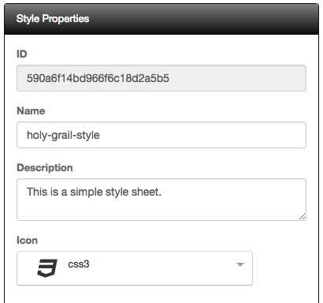
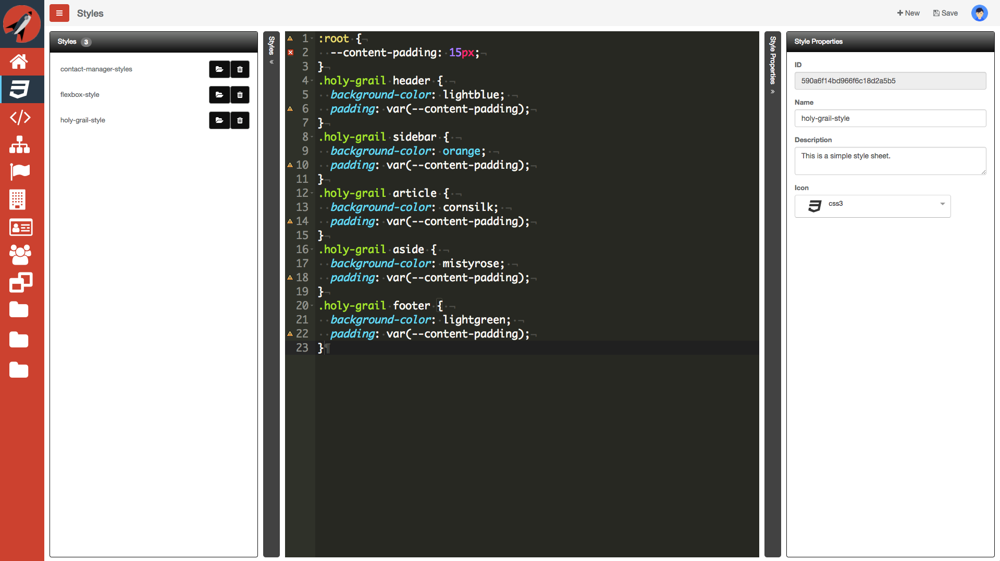

#Style Sheet Tutorial

In this tutorial, we will be creating a simple style sheet that can be used with any screen.

Let's get started.

1) Click on the *Styles* menu item from the navigation menu. Here we will add our style. Enter the following into the Style Properties pane:



2) Next, copy and paste the following code into the editor:

```css
:root {
  --content-padding: 15px;
}
.holy-grail header { 
  background-color: lightblue; 
  padding: var(--content-padding);
}
.holy-grail sidebar { 
  background-color: orange; 
  padding: var(--content-padding);
}
.holy-grail article { 
  background-color: cornsilk; 
  padding: var(--content-padding);
}
.holy-grail aside { 
  background-color: mistyrose; 
  padding: var(--content-padding);
}
.holy-grail footer { 
  background-color: lightgreen; 
  padding: var(--content-padding);
} 
```

3) As you can see from above, we are using CSS Variables. This is now supported in all modern browsers. 

4) Click the save button and the script should now show up on the left dock-pane.



That's it! You have created a style that can be used in any screen! Congratulations!
